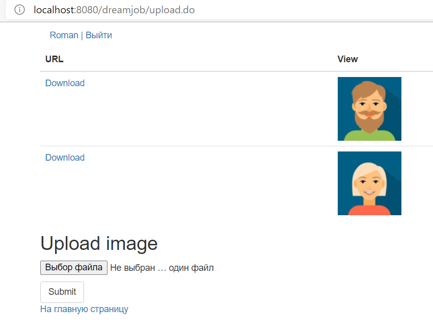

[](https://www.travis-ci.com/RomanRusanov/job4j_dreamjob)
[](https://codecov.io/gh/RomanRusanov/job4j_dreamjob)
[](https://www.codacy.com/gh/RomanRusanov/job4j_dreamjob/dashboard?utm_source=github.com&amp;utm_medium=referral&amp;utm_content=RomanRusanov/job4j_dreamjob&amp;utm_campaign=Badge_Grade)
# job4j_dreamjob

В системе будут два типа пользователей: кандидаты и кадровики. 
Кандидаты будут публиковать резюме и добавлять фото.
Кадровики будут публиковать вакансии о работе.

Простое приложение основанное на MVC с использованием сервлетов, 
простейшей аутентификации, валидация данных через js, persistence слой postgres,
file uploads apache commons, генерация схемы liquibase, web server tomcat.

##ScreenShoots





##Конфигурирование:

*   Для использования необходима заполнить username, password и имя бд(url)```db.properties```
    схема бд будет создана при помощи liquibase
*   Необходим webserver при разработке использовался Tomcat ver.9.0.39

    url - http://localhost:8080/dreamjob/login.jsp

    application context - /dreamjob
*   pom.xml
```
    <db.url>jdbc:postgresql://127.0.0.1:5432/dreamjob</db.url>
    <db.username>postgres</db.username>
    <db.password>password</db.password>
    <db.driver>org.postgresql.Driver</db.driver>
```
##Контакты:
*   skype: rusanov_roman
*   telegram: @Roman_Rusanov

